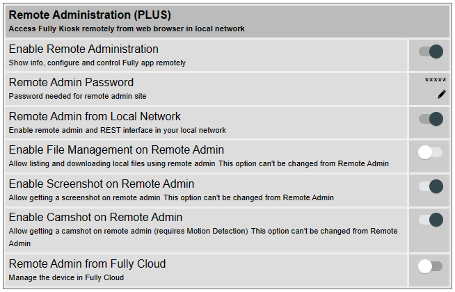
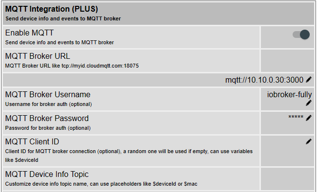

## About this adapter

With this adapter the [Fully Kiosk Browser](https://www.fully-kiosk.com) (with Plus license) can be controlled. Via the [REST API](https://www.fully-kiosk.com/en/#rest) various commands like "screen on/off", "screen saver on/off", etc. can be sent to the Fully.

Additionally - if MQTT is enabled in the adapter options - events (like "screen on") are always immediately communicated to the adapter and set in the corresponding states. Furthermore, if [MQTT](https://www.fully-kiosk.com/en/#mqtt) is active, the Fully Browser always sends all device information automatically at least every 60 seconds, which are set to the accoring info states accordingly. If MQTT is disabled, this info is requested manually on a regular basis via the REST API. Please note that commands are sent via the REST API even if MQTT is enabled, since the Fully Browser does not support sending commands via MQTT.

## Fully-Browser settings

### Activate Remote Admin
1. On the tablet, open the Fully Browser app and open the Fully Browser settings.
1. Open menu item **Remote Administration (PLUS)**
1. Enable **Enable Remote Administration**
1. **Remote Admin Password**: enter a password
1. Enable **Remote Admin from Local Network**

### Activate MQTT
1. On the tablet, open the Fully Browser app and open the Settings. Alternatively, you can also open the Remote Admin from another device (e.g. PC) from a browser, the URL is typically always http://ip-address:2323, you will be asked for the password assigned above.
2. Open: **Settings** -> **Other Settings** -> **MQTT Integration (PLUS)**
3. Enable **Enable MQTT**
4. **MQTT Broker URL**: Enter in the format `mqtt://iobroker-ip-address:3000`, where `iobroker-ip-address` is the IP address of the ioBroker, and `3000` is the port number used for the MQTT connection.
5. **MQTT Broker Username**: here you can optionally enter a username
6. **MQTT Broker Password**: here you can optionally enter a password
7. **MQTT Client ID**: can be left empty
8. **MQTT Device Info Topic**: here you can leave the default setting, it will not be used by the adapter.
8. **MQTT Event Topic**: here you can leave the default setting, it will not be used by the adapter.

## Adapter Settings

### Fully Browser Devices
Add Fully Browser device(s), i.e. the tablets running Fully Browser, accordingly:
1. **Device Name**: Any name, which is also used as part of the objects/states, e.g. `Tablet Flur` becomes `fully-mqtt.0.Tablet-Flur`.
1. **Protocol**: leave `http` as it is. If `https` should be used: see notes under [Remote Admin](https://www.fully-kiosk.com/en/#remoteadmin).
1. **Remote Admin Password**: enter the password as set above.
1. **MQTT**: should be enabled to use all features of the adapter.

### MQTT Configuration
 * **Port**: Use the same port number as above in the Fullybrowser MQTT settings (e.g. `3000`).
 * **User name**: optional
 * **Password**: optional
 * **Do not verify user and password**: can be activated to disable username and password verification

### Expert Settings: Remote Admin (REST API)
 * **Request Timeout**: After this number milliseconds, REST API requests are aborted if not successful.
 * **Request Interval**: How often should the device info be requested (battery level, etc.)? About 60 seconds should be enough, you can also assign a higher interval. *Note*: If MQTT is activated, this will be ignored, because MQTT automatically receives info at least every 60 seconds.
 * **Always update info objects**: Normally all info sets are set/updated only if there was a change. If this option is enabled, states will always be updated (with ack:true), even if there was no change from the previous value.

### Expert Settings: MQTT
 * **Do not process published info more than every x seconds**: Lt. [Fully-Dokumentation](https://www.fully-kiosk.com/en/#mqtt) werden Infos nur alle 60 Sekunden publiziert, in meinen Tests erfolgte dies aber deutlich öfter, also kann hiermit ein Limit gesetzt werden.
 * **Always update info objects**: Normally all info sets are set/updated only if there was a change. If this option is enabled, states will always be updated (with ack:true), even if there was no change from the previous value.
 * **Client and Connection errors as info in log**: If activated, client and connection errors are always output as info and not as error in the log. This serves to keep the log clean and not to fill it unnecessarily just because a tablet logs off briefly and logs on again after a few seconds. "Longer-term" errors and warnings are always displayed in the log accordingly.

 ## Links

* [ioBroker-Forum: Adapter Fully Browser mit MQTT](https://forum.iobroker.net/topic/63705/)
* [fully-kiosk.com REST API](https://www.fully-kiosk.com/en/#rest)
* [fully-kiosk.com MQTT Integration](https://www.fully-kiosk.com/en/#mqtt)